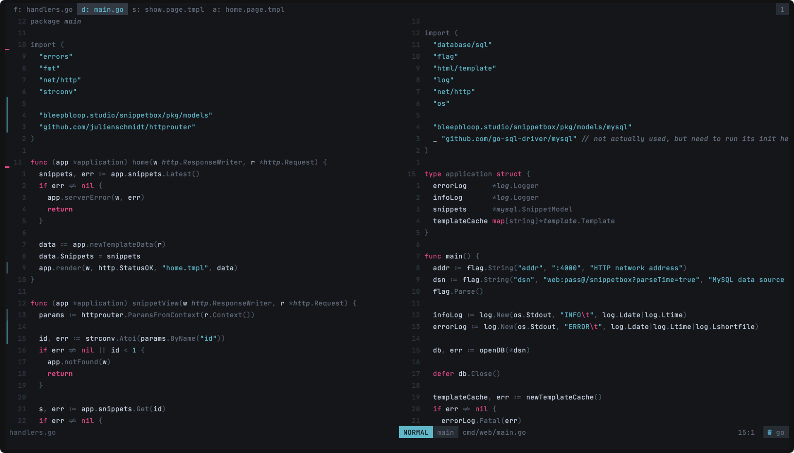

# BLOOP_NVIM

-- Work In Progress 

```

                 .o8       oooo
                "888       `888
                 888oooo.   888   .ooooo.   .ooooo.  oo.ooooo.
                 d88' `88b  888  d88' `88b d88' `88b  888' `88b
                 888   888  888  888   888 888   888  888   888
                 888   888  888  888   888 888   888  888   888
                 `Y8bod8P' o888o `Y8bod8P' `Y8bod8P'  888bod8P'
                                                      888
                                                     o888o

```

A minimalistic theme that focusses on keywords and hard coded values. While
creating a subtle visual hierarchy with a soft monochromatic palette for other
texts.



Requires [lush.nvim](https://github.com/rktjmp/lush.nvim)

## Install

```lua
use('https://github.com/rktjmp/lush.nvim')
use('https://github.com/nocksock/bloop.nvim')
```

## TODO

- [ ] create build without lush dependency
- [ ] include terminal themes
