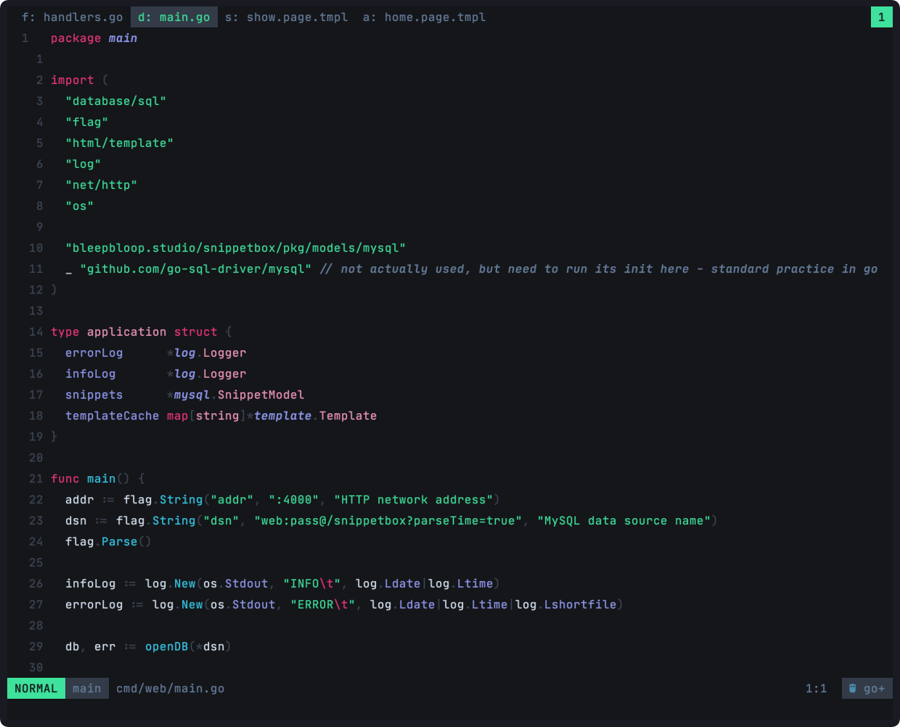
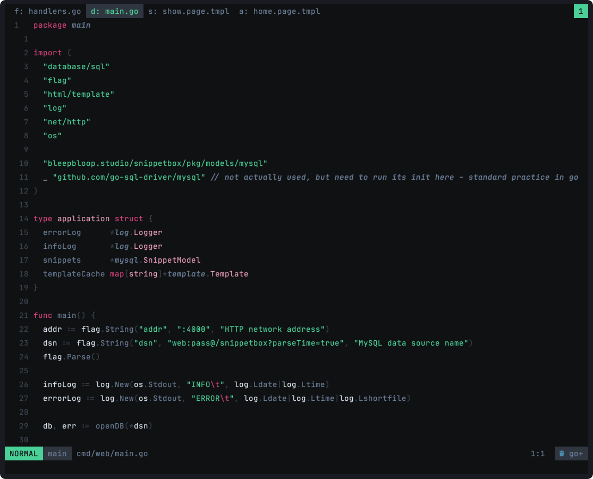
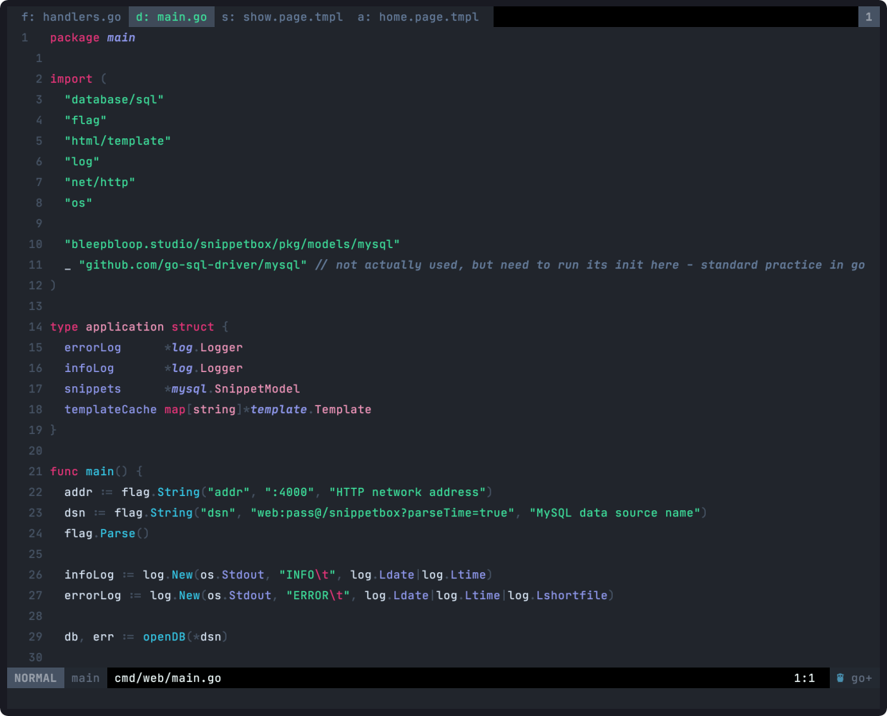

-- 🚧 Work In Progress: there might be some drastic changes

```
      ..          ..
. uW8"      x .d88"
`t888        5888R          u.          u.    .d``
 8888   .    '888R    ...ue888b   ...ue888b   @8Ne.   .u
 9888.z88N    888R    888R Y888r  888R Y888r  %8888:u@88N
 9888  888E   888R    888R I888>  888R I888>   `888I  888.
 9888  888E   888R    888R I888>  888R I888>    888I  888I
 9888  888E   888R    888R I888>  888R I888>    888I  888I
 9888  888E   888R   u8888cJ888  u8888cJ888   uW888L  888'
.8888  888"  .888B .  "*888*P"    "*888*P"   '*88888Nu88P
 `%888*%"    ^*888%     'Y"         'Y"      ~ '88888F`
    "`         "%                               888 ^
                                                *8E
                                                '8>
                                                 "
```


_default_


_night variant with less colors and a little less contrast_


_low contrast variant_

Requires [lush.nvim](https://github.com/rktjmp/lush.nvim)

## Install

```lua
use('https://github.com/rktjmp/lush.nvim')
use('https://github.com/nocksock/bloop.nvim')
```
